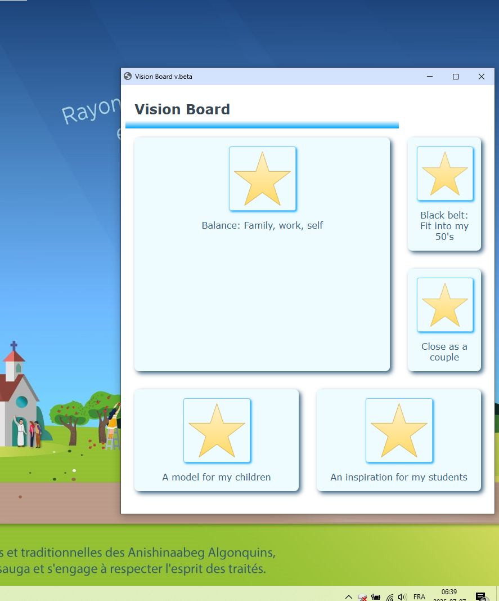
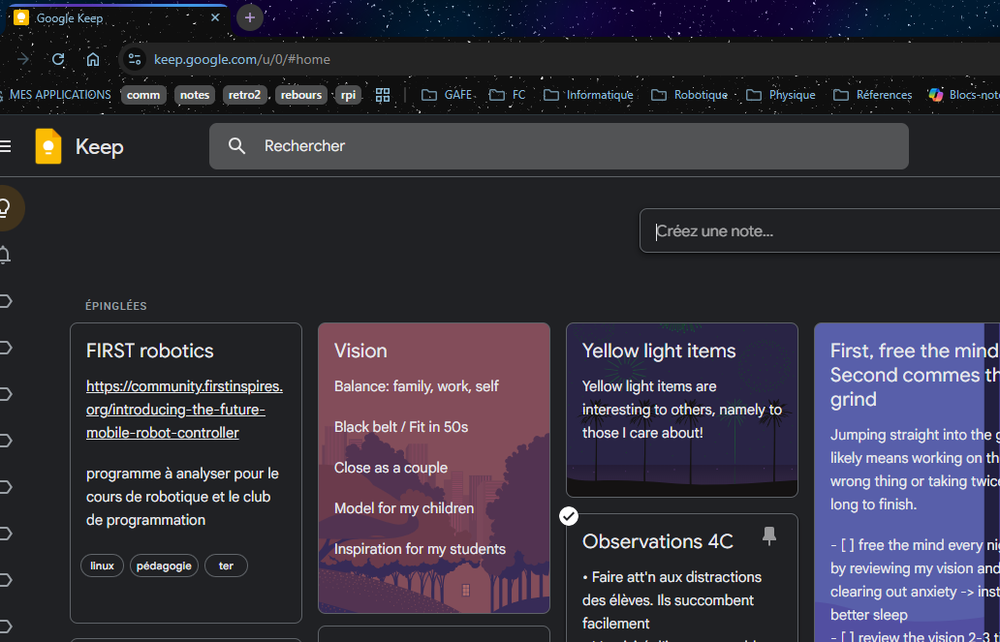

<link rel="stylesheet" href="bbc-style.css">

# Black Belt Club Project

By: David Crowley \|

For: Hanshi John Leroux \|

Ottawa School of Karate-do

<a href="/pages/bbc/landing">BBC Project Home</a>
<a class="active" href="/pages/bbc/values">Values</a>
<a href="/pages/bbc/karate">Karate Goals</a>
<a href="/pages/bbc/personal">Personal Goals</a>
<a href="/pages/bbc/tracking">Dashboards</a>

<h2 id="bbc-values">Values and Vision</h2>

This section presents my personal values and how that manifests as a vision, purpose, code of behaviour and list of goals.

The **context** section presents a bit of history behind these values, since this is not the first time I've been through this process of self-reflection.

Context

### Student Leadership - Origin Story of My Slogan

In the final year of my undergraduate degree at McGill University, the fall of 2003, I ran for President of the Macdonald Campus Student Society along with my friend Maxime who ran for VP of Business. We both won. Part of the successful campaign involved coming up with a fitting slogan.

You have already seen it if you have read any of my emails:

> Committed to our success \| Engagé dans notre succès

I originally started with "committed to _your_ success" but Maxime thought that it was more important to convey that success would be shared and mutual. I agreed and that slogan has stayed with me ever since.

### Coaching soccer - Sharing My Philosphy for Team Excellence

In 2008 after a few youth coaching roles in Alma, Lac St-Jean, the Cegep's sporting director approached me with an offer to relaunch their men's soccer team.

I invested heavily in reference materials in both tactics and techniques but also sports psychology. Especially after seeing how mixed the skill level of the original team was, I knew we would need to rely mostly on belief in the team and improving on objectives rather that gauging our success on wins.

This is Team Philosphy document I came up with at the time, and I remembered it at some point in the last year when certain parts of _kaizen_ were discussed in class. That moment created a powerful sense of belonging at the dojo, and I knew that whatever differences of opinion we may occasionally have, we would very likely always be able to resolve it on account of our very similar shared visions.

<iframe src="https://docs.google.com/document/d/e/2PACX-1vTvXfaOzZQYb_SZrR7kjL1ZTqknjeJZZdIKETqbfPcdo7MiV3gQiPbkIwwbZ7Atams1oVORnsWXOSEH/pub?embedded=true">

</iframe>

### Vision Board 2024

I did not attend last year's Vision Board leadership seminar, but I was captivated by the idea and ended up implementing my own version after asking some questions about it at the dojo. I have this vision board load on my desktop everytime I log onto my computer and as a pinned note in the Google Keep tab that opens as my home page every time I open my web browser.

> The biggest part of that vision is :
> - Balance: family, work, self
> 
> The other four elements of that vision are :
> - Black belt / Fit in 50s
> - Close as a couple
> - Model for my children
> - Inspiration for my students

Desktop pop-up on start-up

Pinned note in Google Keep

Vision, Purpose, Code of conduct

### Vision

> Approachable by all in good times and in times of need. A reliable husband, parent and teacher whose word is a guarantee. An inspiring model of continuous improvement.

### Purpose

> My purpose is to build confidence in others and inspire them to pursue their dreams. Part of that journey, for all of us, involves
> growing beyond fear to be more caring and gentle. Ultimately, I dream of a world where all of us are connected by common values and experiences, 
> not divided by ideological or cultural differences.

### Identity

> I am a bilingual Canadian father with Irish heritage and a love of rhythms from all around the world.
> I am curious, intelligent, enthusiastic, youthful and athletic.
> I believe in "one tribe" - a shared humanity - in mutual respect and care and in a mentality of improve or perish.

### Personal Code of Conduct

<blockquote markdown=1>

I may not always commit to all tasks or challenges put before me, but any that I do accept, I engage with to the best of my abilities: 
- setting aside time, thought and energy; 
- checking to see if my progress is to the "client's" satisfaction;
- correcting mistakes and making up for failings;
- seeing the work through to the end

I call this process "excellence". For me, excellence is not a state nor an achievement but a process of continually getting better for yourself and for the people you work with and work for. I originally defined excellence in this way in 2008 for a soccer team I coached. The original can be found in the [context section](#coaching-soccer) above. Since I've begun my karate journey, I immediately recognised **kaizen** as a very similar, if not identical, concept.

</blockquote>

### Putting It All Into Action

Rules and values

For Safety and Success:

- admit mistakes and make it right
- protect mobility as the top physical priority
- be gracious and give chances
- engage others based on their interests and abilities
- reward and encourage efforts to attempt hard things
- build and use systems for time management

Personal:

- One tribe: we all have a shared humanity
- mutual respect and care
- keep trying
- take risks
- share your "riches" with others
- stay active and protect that ability

Drivers

What I Love

- intense physical activity
- good music - all genres
- growth / plastic mindset
- working with my hands and my mind to make things
- seeing others surpass their own expectations

What I Hate

- losing track of time
- not being able to estimate time effectively
- not being prepared and having to improvise
- when fear causes me or others to waste energy fighting against collaboration or exploration

What excites and motivates me

- new things that can help my students and children
- new insights into my own struggles
- feeling healthy and energetic
- seeing my kids improve and become more independant
- seeing my wife happy and relaxed

What I'm Committed To

- Improving my ability as a kind, gentle, supportive and active human (person, husband, father, teacher, coach/mentor).

Categories For Improvement

### Personal

- Being more reliable: following through on my word without caveats or renegotiation
- Listening and validating: stay calm and do not interrupt or add my ideas/feelings while listening
- Understand anxiety better: help my daughter (and my students)
- More disciplined sleep routine
- Spending time: being emotionally present throughout the year

### Professional

- Timely, effective feedback: correcting valid work efficiently
- Better balance: my current systems create unsustainable workload; I need better alternatives
- Engaging everyone: lower floor, higher ceiling -> designing projects all students can get excited about
- Punctuality: being ahead of time

### Ideas for action

For karate

- Leverage the dojo: time on the mat, access to mirrors, feedback from teachers and students
- Follow other model martial artists: Gabriel Vargas (kicks) and Bertrand Jaillet (shotokan stances and movements)
- Apply previous knowledge: use my former ATG programs for bulletproofing workouts

For personal and professional goals

- Build on the successes of my therapy, medication and systems for time management and being present
- Use the private chat group I have access to through Flow State to continue to document my immediate work intentions and the real time/progress made
- Keep open communication with my family, and make that a priority
- Focus on function at the expense of form (have what I need first before what I want)

### Ideas for consequences

Celebrating success

- Add a star to a shirt/board
- Tell myself I knew I could do it (positive affirmation)
- Have an (extra) date night with Alli
- Invest in a Bells of Steel kettlebell

Stakes for failure

- Have students propose forfeits if I miss correcting deadlines
- Fold **all** the laundry for a week
- Do **all** the dog walks for a week
- Prepare **all** the dinners for a week

